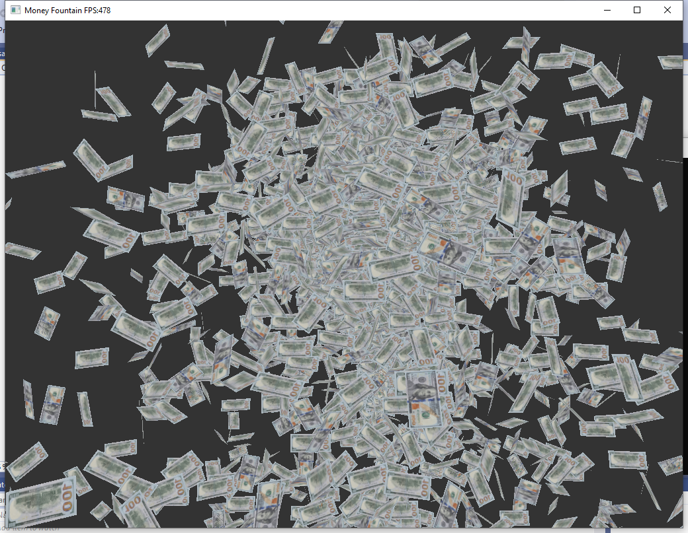
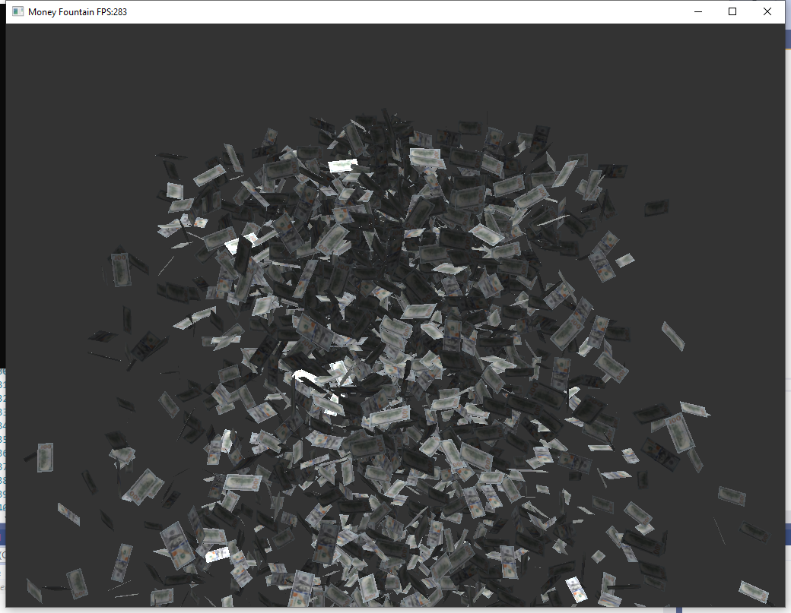

# OpenGL-Money-Fountain
Simple particle effects implemented by glfw

# Adjust the particle spreading effects
#define TOTAL_PARTICLES // total particles that are allowed  
#define SPREAD_MIN_ANGLE // minimum spreading angle correspond to X and Y axises  
#define SPREAD_MAX_ANGLE // maximum spreading angle correspond to X and Y axises  
#define MIN_ACCELERATION // minimum initial particle acceleration   
#define MIN_ACCELERATION // maximum initial partcile acceleration  
#define GRAVITY //gravity  
#define MIN_ROTATE_DELTA //minimum particle rotation  
#define MAX_ROTATE_DELTA //maximum parctile rotation  
#define PARTICLE_SPAWN_INTERVAL //the time interval to spawn a new particle  
  
# Screenshots

2/4/2021 with lighting

